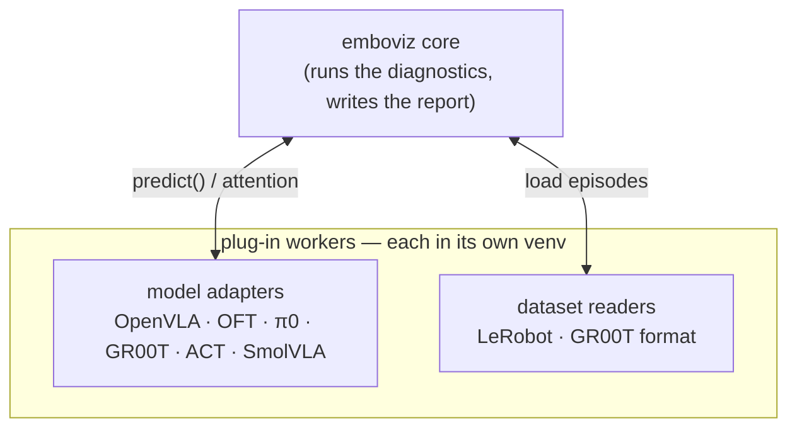

# Architecture

This document describes how Emboviz is structured and how to add a new model,
dataset format, or diagnostic.

## Overview

A VLA policy and a robot dataset each require a heavy, version-pinned dependency
stack (`torch`, `transformers`, `lerobot`, `openpi`), and these stacks are
frequently mutually incompatible. **Emboviz core** depends on neither `torch`
nor `lerobot`. It runs every heavy component as a separate worker process in its
own virtual environment and communicates with each worker over msgpack-encoded
messages on a ZeroMQ socket.



Core imports no model or dataset code. It depends only on two interfaces:

- **`VLAModel`** — a model. Given a scene, it returns an action, and optionally
  exposes its attention or hidden states.
- **`EpisodeSource`** — a dataset. It lists its episodes and turns one into a
  sequence of frames.

The diagnostics, calibration, and the Rerun report are all written against these
two interfaces, so they operate on any registered model and dataset without
modification.

## Extension points

A contribution is a small package that implements one of the two interfaces.
Emboviz core discovers it through a Python entry point at runtime; core itself
does not change.

### Adding a model

1. Create a package `emboviz-<name>` that depends on `emboviz-wire`.
2. Subclass **`VLAModel`** (`emboviz_wire/model_protocol.py`). The one required
   method is `predict(scene) -> ActionResult`. The subclass also declares:
   - `capabilities` — the surfaces it can expose (`INFERENCE`, `ATTENTION`, …).
     A diagnostic that requires an absent capability skips itself with a reason.
   - `required_inputs` — the scene fields it consumes (cameras, state, gripper,
     instruction). The runner validates each scene against this before
     `predict()` is called.
   - `extract_attention()` and the other inspection methods are implemented only
     for the capabilities the adapter advertises; otherwise they default to
     raising `NotSupported`.
3. Declare an **`AdapterSpec`** (the worker venv's Python version and its pip
   requirements) and register it via the `emboviz.adapters` entry point:
   ```toml
   [project.entry-points."emboviz.adapters"]
   mymodel = "emboviz_mymodel.spec:SPEC"
   ```

`adapters/emboviz-openvla` is the reference implementation to copy.

### Adding a dataset format

1. Create a package that depends on `emboviz-wire`.
2. Subclass **`EpisodeSource`** (`emboviz_wire/reader_protocol.py`), which
   requires three methods: `list_episodes()`,
   `load_episode(id) -> list[Scene]`, and `all_instructions()`. Each scene's
   robot profile is constructed with `emboviz_wire.dataset_build.build_profile`
   so that every reader produces an identical profile shape.
3. Register the reader via the `emboviz.readers` entry point and route its
   `dataset.format` name in `emboviz/datasets/manifest.py`.

`adapters/emboviz-lerobot` is the reference implementation to copy. LeRobot and
the GR00T format are separate readers because they pin incompatible `lerobot`
versions, which is the reason each worker has its own venv.

### Adding a diagnostic

A diagnostic is a single file in `emboviz/diagnostics/`. It combines a
**perturber** (`emboviz/perturb/`, which modifies a scene) with a **metric**
(`emboviz/metrics/`, which compares the resulting actions) and runs against the
`VLAModel` interface. Because it operates only on the shared types, it applies to
every model and dataset automatically. Each diagnostic cites its method in
[`LITERATURE.md`](./LITERATURE.md).

## Shared types

All data crossing the wire is built from the format-neutral types in
`emboviz_wire/types.py`, so a diagnostic never depends on which model or dataset
produced its inputs:

- **`Scene`** — one timestep: the camera images, robot state, gripper,
  instruction, and a `RobotProfile` describing the embodiment.
- **`Trajectory`** — an episode's scenes in order.
- **`ActionResult`** — a prediction: a continuous action vector (for every
  model, including those that are internally discrete or flow-matching) and an
  optional action chunk.

These types, the two interfaces, and the ZeroMQ/msgpack transport live in
**`emboviz-wire`**, the single lightweight package installed into both core and
every worker. Because the transport is bytes rather than pickle, a worker on
Python 3.11 and core on Python 3.12 exchange a `Scene` without version coupling.

## Worker lifecycle

When `emboviz analyze` requires a model or dataset, core resolves the
installed package via its entry point, creates the worker's virtual environment
on first use (`uv venv` followed by `uv pip install`), launches the worker, and
connects to it. The worker remains running between invocations, so a model loads
once per session. This logic is contained in `emboviz/adapters/lifecycle.py`; no
other module manages processes or virtual environments.

## Repository layout

```
emboviz/                 emboviz core — the lean engine (no torch, no lerobot)
  adapters/        worker discovery + lifecycle
  datasets/        routes dataset.format → the right reader
  perturb/         scene perturbers (mask, occlude, modality swap, …)
  metrics/         action comparisons
  diagnostics/     the shipped diagnostics
  exporters/       Rerun .rrd writer + report.md/html
  cli/             analyze · list-adapters · install-<name>

adapters/                plug-in workers — one venv each
  emboviz-wire     shared interfaces + types + wire plumbing + the policy bridge
  emboviz-openvla · emboviz-oft · emboviz-pi0 · emboviz-gr00t   model workers
  emboviz-act · emboviz-smolvla   lerobot-policy model workers
  emboviz-sam3     text→mask detector worker
  emboviz-lama     LaMa inpainting fill worker (on-manifold memorization fill)
  emboviz-lerobot · emboviz-reader-gr00t   dataset readers
  emboviz-ctrlworld · emboviz-cosmos3   world-model workers (stress test)
  emboviz-robot    forward kinematics (in-process, injected into the drivers)
```

## World models

A third worker contract, **`WorldModel`** (`emboviz_wire/world_model_protocol.py`),
backs the closed-loop stress test: given a conditioning frame and a sequence of
actions, predict the future frames. World-model packages register through the
`emboviz.world_models` entry-point group and use the same venv/spawn machinery
as model adapters. Two backends ship: `emboviz-ctrlworld` loads its checkpoint
locally on the GPU and additionally conditions on pose-anchored history (it
declares `conditions_on_history`, and the closed-loop driver passes the
rollout's anchor frames on every call); `emboviz-cosmos3` is a GPU-free HTTP
client to a separate vLLM-Omni server. A Ctrl-World checkpoint's contract —
views, sizes, rates, history schedule, action bounds, weight locations — is a
`CtrlWorldProfile` (`emboviz_ctrlworld/profiles.py`): a catalog name or a
profile JSON, so a new checkpoint is data, not code. The model-agnostic policy bridge —
integrating a policy's action chunk into the Cartesian state sequence a world
model conditions on, under a declared action convention — lives in
`emboviz_wire/policy_bridge.py`; each adapter owns only its model-specific
action encoding.
