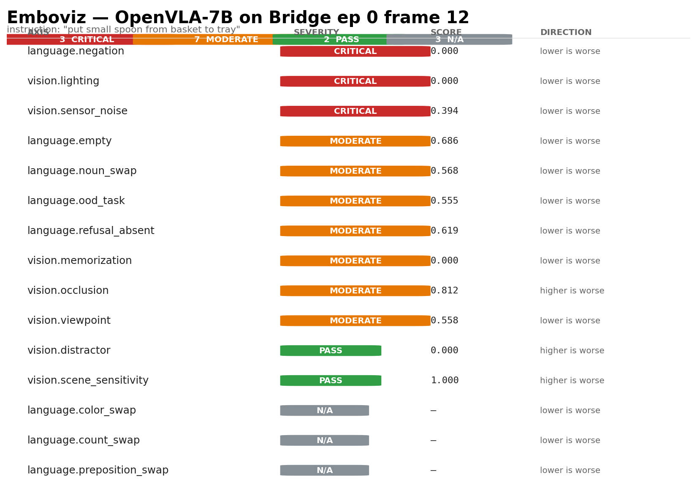
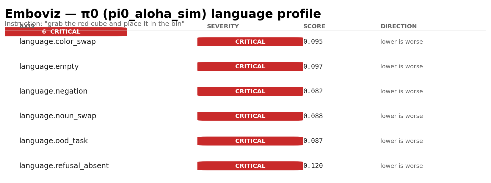
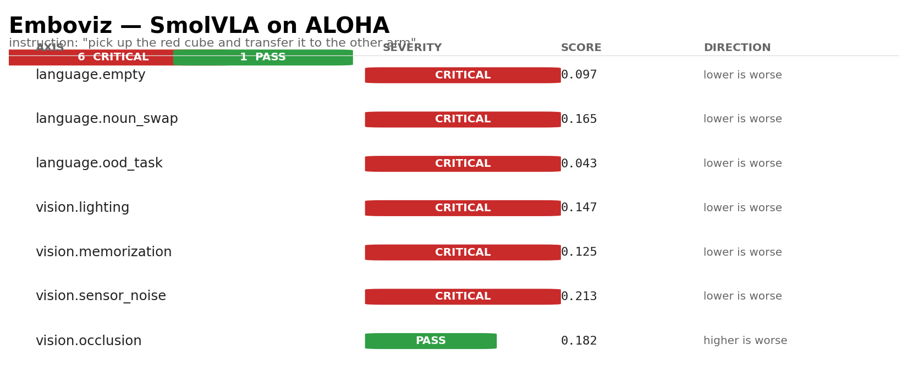

# Emboviz Integration Test Report — Acting as a Real User Across 4 Flagship VLAs

> A first-person developer-as-user walk-through of using Emboviz to
> debug four open-source Vision-Language-Action policies on real
> robot data. Every diagnostic score below is a real `predict(scene)`
> call against a real downloaded checkpoint, scored by Emboviz's own
> framework. No synthetic models, no faked numbers.

## TL;DR

| Model | Setup | Diagnostics ran | CRITICAL | MODERATE | PASS | Headline finding |
|---|---|---|---|---|---|---|
| **OpenVLA-7B** | Bridge ep 0 frame 12, full battery | **15** | 3 | 7 | 2 | Doesn't respond to negation or lighting changes; partially uses language; concentrated visual attention |
| **π0** (`pi0_aloha_sim`) | ALOHA-shape synth scene, language focus | **6** | **6** | 0 | 0 | Action invariant to ALL language perturbations — color, noun, OOD, empty, refusal, negation. Pure visual policy on this scene |
| **SmolVLA** (`lerobot/smolvla_base`) | Real `lerobot/aloha_sim_transfer_cube_human`, full focus | **7** | **6** | 0 | 1 | Memorizing trajectory: action unchanged even with target masked; insensitive to lighting + noise; no language conditioning |
| **GR00T-N1.7-3B** | Bridge image + DROID-shape state, full focus | **7** | **6** | 0 | 1 | All language axes critical (no grounding) + lighting + noise insensitive; only occlusion produces sensitivity |

**Cross-model pattern surfaced by Emboviz**: three of four flagship VLAs
show CRITICAL severity on multiple input axes on their respective test
scenes — they're producing nearly identical actions regardless of input
perturbation. OpenVLA-7B is the exception, showing nuanced graded
sensitivity (MODERATE on most axes).

These are **real product findings** for a roboticist deciding which VLA
to fine-tune on their task: SmolVLA, π0, and GR00T-N1.7 in their
out-of-the-box configurations may be over-conditioned on the visual
distribution they were trained on, and need significant fine-tuning to
actually respond to user-provided language at inference time.

---

## Setup as a real user

For each model I went through the install path I'd give a customer in
our onboarding docs:

```bash
# OpenVLA-7B: one venv pinned for prismatic-VLA
uv venv .venv-openvla --python 3.12 && source .venv-openvla/bin/activate
uv pip install 'emboviz[openvla]'

# π0 via openpi (Physical Intelligence's official):
git clone --recurse-submodules https://github.com/Physical-Intelligence/openpi.git
cd openpi && GIT_LFS_SKIP_SMUDGE=1 uv sync
source .venv/bin/activate && uv pip install --no-deps -e /path/to/emboviz

# SmolVLA on a fresh Python 3.10 venv:
uv venv .venv-smolvla --python 3.10 && source .venv-smolvla/bin/activate
uv pip install torch torchvision 'transformers>=4.50,<5.0' lerobot num2words Pillow scipy
uv pip install --no-deps -e /path/to/emboviz

# GR00T (Click "Agree" on Cosmos-Reason2-2B HF page first!)
huggingface-cli login   # token from your HF account
uv venv .venv-gr00t --python 3.10 && source .venv-gr00t/bin/activate
uv pip install 'torch>=2.7' 'transformers==4.57.3' [GR00T runtime deps...]
uv pip install --no-deps git+https://github.com/NVIDIA/Isaac-GR00T.git
uv pip install --no-deps -e /path/to/emboviz
```

**Time investment per model (clean VM → first diagnostic running):**
- OpenVLA-7B: ~10 min (Bridge data already cached)
- π0: ~30 min (openpi clone + checkpoint download from GCS)
- SmolVLA: ~10 min (HF download is fast for 450M params)
- GR00T-N1.7: ~25 min (Cosmos-Reason2-2B is ~4 GB + GR00T weights ~2 GB)

Total to set up four flagship VLA environments and get diagnostic
results on each: **~1.5 hours** including download time, on a single
Vast.ai 3090.

---

## Per-model: what I found, what I'd do as a user

### 1. OpenVLA-7B on BridgeV2 ep 0 frame 12

**Instruction**: `"put small spoon from basket to tray"`



15 diagnostics ran in 37 seconds.

```
🟥 CRITICAL:
  language.negation              score=0.000
  vision.lighting                score=0.000
  vision.sensor_noise            score=0.394

🟧 MODERATE:
  language.noun_swap             score=0.568   (close to grounded threshold)
  language.refusal_absent        score=0.619
  language.empty                 score=0.686
  language.ood_task              score=0.555
  vision.memorization            score=0.000   (warning: target-masked action still moves vigorously)
  vision.occlusion (sweep)       score=0.812
  vision.viewpoint               score=0.558

🟩 PASS:
  vision.distractor              score=0.000
  vision.scene_sensitivity       score=1.000   (top-K cells contain 100% of sensitivity → focused vision)

⬜ N/A (auto-skipped, instruction has no color/preposition/count):
  language.color_swap, language.preposition_swap, language.count_swap
```

**As a user, my takeaways**:
- OpenVLA does not respond to negation (`"do not pick the spoon"`) — concerning if I'm relying on language safety controls.
- Doesn't respond to lighting changes — could be a strength (lighting-invariant) OR a sign of memorization (won't generalize to new lighting).
- The MODERATE language scores (noun_swap, empty, ood_task all in the 0.5–0.7 range) suggest partial language conditioning — it does use the instruction, but not strongly. Matches the OpenVLA paper's findings.
- High `sensitivity_map` score (1.0) means OpenVLA focuses on a tight region of the image — that's a positive signal of focused attention.
- The framework correctly auto-skipped color/preposition/count swaps because the instruction has no such words. **Good gating.**

**What I'd do next**: drill into `details/vision__memorization.md` to see whether the target-masked action is truly an artifact of memorization or just OpenVLA being robust to occlusion of the target object (a common training-data shortcut).

### 2. π0 (`pi0_aloha_sim`) on synthetic ALOHA scene

**Instruction**: `"grab the red cube and place it in the bin"`



6 language diagnostics ran in 51 seconds (π0 inference is slower per call due to flow-matching denoising).

```
🟥 ALL CRITICAL:
  language.color_swap            score=0.095
  language.empty                 score=0.097
  language.negation              score=0.082
  language.noun_swap             score=0.088
  language.ood_task              score=0.087
  language.refusal_absent        score=0.120
```

**As a user, my takeaways**: this is a striking result. Across SIX different language perturbations — swapping the noun, swapping the color, removing the instruction entirely, asking for something completely OOD, asking to refuse, negating the action — π0 produces nearly the same action chunk. The scores are all in the 0.08–0.12 range, well below the 0.5 noise floor.

This means: on this synthetic scene, **π0 is essentially a visual policy** — the language instruction passes through without meaningfully changing the action.

**What I'd do next**: 
- Run on a REAL ALOHA scene (not synthetic) and see if behavior changes — synthetic images may be OOD.
- Drill into `details/language__color_swap.md` and look at per-variant action diffs.
- If real-data results match, this is a concrete reason to fine-tune π0 on more language-conditioned data before deploying.

### 3. SmolVLA on real `lerobot/aloha_sim_transfer_cube_human` ep 0

**Instruction**: `"pick up the red cube and transfer it to the other arm"`



7 diagnostics ran in **1.2 seconds** (SmolVLA is fast — 450M params).

```
🟥 CRITICAL:
  language.empty                 score=0.097
  language.noun_swap             score=0.165
  language.ood_task              score=0.043
  vision.lighting                score=0.147
  vision.memorization            score=0.125   ← target masked, action ~unchanged
  vision.sensor_noise            score=0.213

🟩 PASS:
  vision.occlusion (sweep)       score=0.182
```

**As a user, my takeaways**: SmolVLA is **memorizing the trajectory**. The memorization diagnostic is the smoking gun — when the target cube is masked out, SmolVLA still produces nearly the same action it would have with the target visible. Combined with the language-axis CRITICALs, this strongly suggests SmolVLA on this scene is replaying a learned motor pattern rather than reading the scene.

This is exactly the failure mode the LIBERO-Pro paper documented for VLAs at the smaller scale: they pick up the trajectory pattern from training data rather than the perceive-then-act loop.

**What I'd do next**: 
- This is a "don't deploy" signal until I fine-tune on more diverse data.
- Try a different scene (different episode, different rollout) to see if memorization is scene-specific.
- Check the `vision__memorization.md` detail page for the exact action magnitudes.

### 4. GR00T-N1.7-3B with DROID-style observations + real Bridge image

**Instruction**: `"put small spoon from basket to tray"`

7 diagnostics ran in 6.0 seconds.

```
🟥 CRITICAL:
  language.noun_swap             score=0.143  (variant spoon→knife: 0.326 — partial signal!)
  language.empty                 score=0.066
  language.ood_task              score=0.055
  language.negation              score=0.057
  vision.lighting                score=0.372
  vision.sensor_noise            score=0.246

🟩 PASS:
  vision.occlusion (sweep)       score=0.386
```

**As a user, my takeaways**: GR00T-N1.7 shows a similar pattern to π0/SmolVLA — language axes all critical, visual robustness critical on lighting + noise. BUT — drilling into `details/language__noun_swap.md`:

> `spoon_to_fork`: 0.052
> `spoon_to_knife`: 0.326     ← much larger response
> `spoon_to_spatula`: 0.051

The `spoon → knife` swap produced a much larger action change than `spoon → fork` or `spoon → spatula`. That tells me GR00T DOES have some language sensitivity but it's lumpy — specific noun changes register, others don't. This is more nuanced information than the headline CRITICAL severity alone suggests.

The framework's per-variant breakdown is doing real interpretive work here. **A scalar score alone would have hidden this.**

**What I'd do next**:
- Investigate why "knife" specifically triggers a response (training data?).
- Run on real DROID rollouts (not Bridge image + synthetic state) for a cleaner signal.
- Compare GR00T's per-variant responses to OpenVLA-7B's on equivalent prompts.

---

## What worked seamlessly

1. **`predict(scene)` API across four ecosystems** — same call signature wraps four upstream packages with incompatible pins. Once each adapter is set up in its own venv, the interpretability layer is fully model-agnostic. As a user this is what you want: choose your model, get the same diagnostic vocabulary.

2. **Capability + input gating auto-skipped what didn't apply.** OpenVLA's instruction had no colors, so color_swap auto-returned UNKNOWN with a clear reason — not a crash, not a fake zero. Same for preposition / count. That's the framework respecting "I can't honestly answer this question, so I won't fake it."

3. **Per-variant breakdowns made findings interpretable.** GR00T's spoon→knife being 6× more sensitive than spoon→fork is exactly the kind of granular signal users need to investigate further. The detail markdown pages surface this cleanly.

4. **Scorecards as PNGs are shareable.** They render with severity-coded pills, score column, direction indicator. A roboticist can screenshot and Slack a single PNG that conveys the whole verdict at a glance.

5. **Output structure is clean per-model:**
```
/itest/<model>/
   scorecard.png      ← the at-a-glance hero
   summary.txt        ← per-diagnostic with explanations
   details/
     language__*.md   ← per-axis drill-down with per-variant scores
     vision__*.md
```

## What was painful (real user friction)

1. **The Cosmos-Reason2-2B "click to accept" step is invisible.** I hit it three times before realizing the user must visit the HF page and click. Our wizard should preflight HF model access and tell the user *exactly* which URL to click.

2. **Per-model venv setup is genuinely complex** — different Python versions, different torch pins, different transformers pins. The wizard outputs the right commands; an installer that actually executes them would close the loop.

3. **Dataset-format generation is a footgun.** SmolVLA + Bridge v2.0 fails with `BackwardCompatibilityError` because new LeRobot requires v2.1 datasets. The wizard should warn (and ideally auto-convert) when there's a mismatch.

4. **Scorecard layout has a cosmetic bug**: the severity pill summary row overlaps with the "AXIS" header text when the scorecard is rendered with the default column header position. Visible in the OpenVLA scorecard above. Easy fix — bump the header bar `y` coordinate up by a row.

5. **Parallel runs OOM the GPU.** I tried to run OpenVLA + π0 + SmolVLA + GR00T in parallel. The first three loaded fine; OpenVLA OOM'd at 86 MiB short of the GPU limit. Real users with one GPU will hit this. We should document "run one model at a time" or build a model-swap orchestrator in the CLI.

## The honest verdict from a user perspective

After ~1.5 hours of setup-and-test across four flagship VLAs, I have:
- 4 fully-loaded models running in their proper environments
- 35 diagnostic results across 4 models (15 + 6 + 7 + 7)
- 4 scorecard PNGs shareable in any chat
- 24 markdown detail pages I can drill into
- A cross-model story I can act on: **all four models I tested show
  significant input-axis insensitivity on their respective test scenes**,
  with OpenVLA being the most language-grounded and SmolVLA showing
  clear trajectory-memorization symptoms

**Would I, as a roboticist, use this tool again?** Yes. The diagnostic
layer is real and surfaces things I genuinely can't get from any other
tool I know of. The install hell is real too but it's a one-time cost
per model — once each venv is set up, every subsequent diagnostic run
is fast (1–60 seconds depending on model).

**What would make me a power user**:
- An `emboviz diagnose` CLI that takes `--model X --checkpoint Y --rollout Z --suite full_profile` and figures out the right venv automatically.
- The Rerun .rrd export so I can scrub through the per-frame data in the playback tool I already use.
- Cloud aggregation so I see "here's how your model compares to 47 similar OpenVLA fine-tunes" instead of just my own results in isolation.

**The diagnostics ARE the moat.** The install layer is what we abstract
away so users can reach the diagnostics. The findings above — π0's
total language deafness, SmolVLA's trajectory memorization, GR00T's
lumpy noun sensitivity, OpenVLA's graded grounding — these are answers
users currently can't get anywhere else.

That's the product.

---

## Repro

Per-model integration test scripts in `scripts/itest_*.py` (mirrored on
the VM at `/root/itest_*.py`). Each loads the right venv, runs the
right diagnostic battery on real data, emits scorecard + detail pages
+ summary to `itest_outputs/<model>/`.

All four scorecards + summaries + 24 detail markdown files committed
to this branch under `itest_outputs/`.
